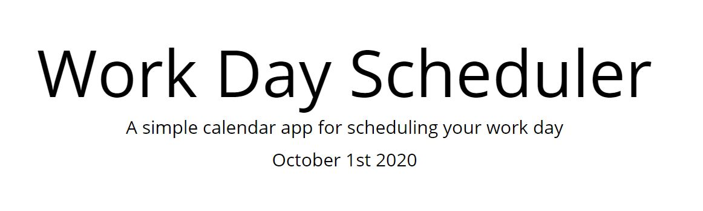
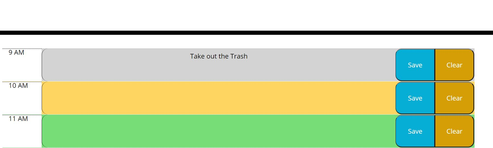

# Daily-Planner
Keep track of your daily responsiblities with this helpful Daily Planner.  Built with HTML, CSS, and JavaScript. 

## Link

https://carl-33.github.io/Daily-Planner/

## Usage Instructions

Today's date is displayed at the top of the page using moment.js

The current hour is diplayed in yellow, past hours are displayed in gray, and future hours are displayed in green.  Enter any todo items into the corresponding hour box, and hit save to save the information. Then hit Clear and refresh the page to remove once the task is completed. 

## Installation Instructions

N/A
